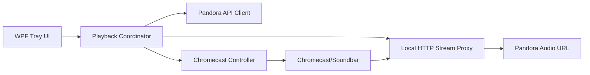

  

# PandoCast

Unofficial Windows tray app for casting Pandora stations to Chromecast-compatible speakers.

## Status

It works on my Windows 10 machine. Probably for 11 too.

## Why this exists

I've been enjoying Pandora's station algorithms more than Spotify lately. Usually, I cast music from my computer to my soundbar, but I noticed the audio cuts out every so often for a second. It only happens on Pandora. From my digging, I think it has to do with some data buffering and/or data jam in the Pandora -> Google Chrome Browser Tab casting pipeline. 

Pandora does not provide neither a native casting feature in their web player, nor a native lightweight Windows tray casting experience for this use case. It annoys me just enough, that I created this program. PandoCast bridges that gap by combining Pandora authentication, station retrieval, local stream proxying, and Chromecast playback control.

## Features

- Windows system tray app
- Pandora login
- Station list
- Station modes
- Chromecast receiver discovery
- Local HTTP stream proxy
- Play/pause/skip/volume controls

## Screenshots

   

## Download

Download the latest `PandoCast.exe` from [Releases](../../releases) and run it.

Windows SmartScreen may warn because the app is not code-signed yet.

## Installation

1. Download the latest `PandoCast-*-win-x64.exe` from [Releases](../../releases).
2. Run `PandoCast-*-win-x64.exe`.
3. Log in with your Pandora account.
4. Select a Chromecast-compatible receiver.
5. Allow Windows Firewall access if prompted so your Chromecast device can connect to the local stream proxy.

## Architecture

## Privacy

PandoCast stores your Pandora credentials locally using Windows DPAPI under your Windows user profile. Credentials are used only to authenticate with Pandora. PandoCast does not include telemetry, analytics, or third-party tracking.

## Limitations

- Windows only
- Unofficial Pandora API usage
- May break if Pandora changes endpoints
- First run may require Windows Firewall permission

## Development

1. dotnet restore
2. dotnet build

## Contributing

PRs welcome. Please open an issue first for larger changes.

## Roadmap

- Skip song

## Hire me / About the builder

I built PandoCast as a practical product/engineering project: a real Windows desktop app that combines API research, reverse engineering, authentication, local networking, Chromecast integration, WPF UX, release automation, and user-focused product design.

My background is CEO/VP-level marketing and go-to-market leadership, with hands-on experience in software development, DevOps, and product strategy. I've done advertising, done CPG. I am currently looking to move closer to technical products — especially roles in product marketing, technical product marketing, product strategy, developer-focused marketing, or product management.

If you are building technical products and need someone who can connect customer insight, positioning, product thinking, and actual implementation, I would be glad to connect.

- LinkedIn: [https://www.linkedin.com/in/lennychase](https://www.linkedin.com/in/lennychase)
- Email: `lenny (Shift+2) lennychase.com`